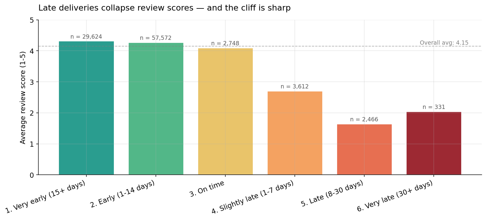
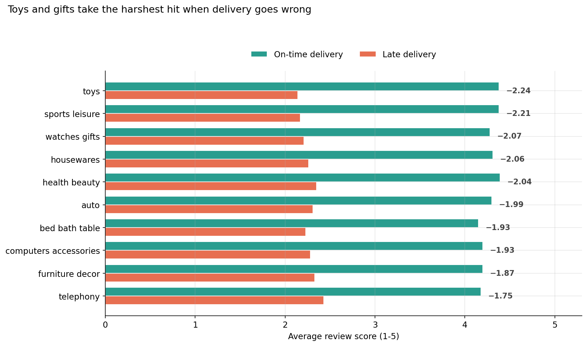
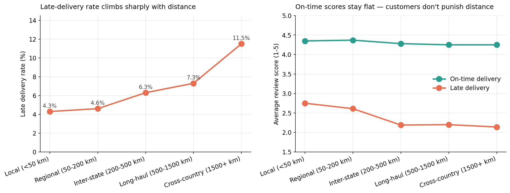
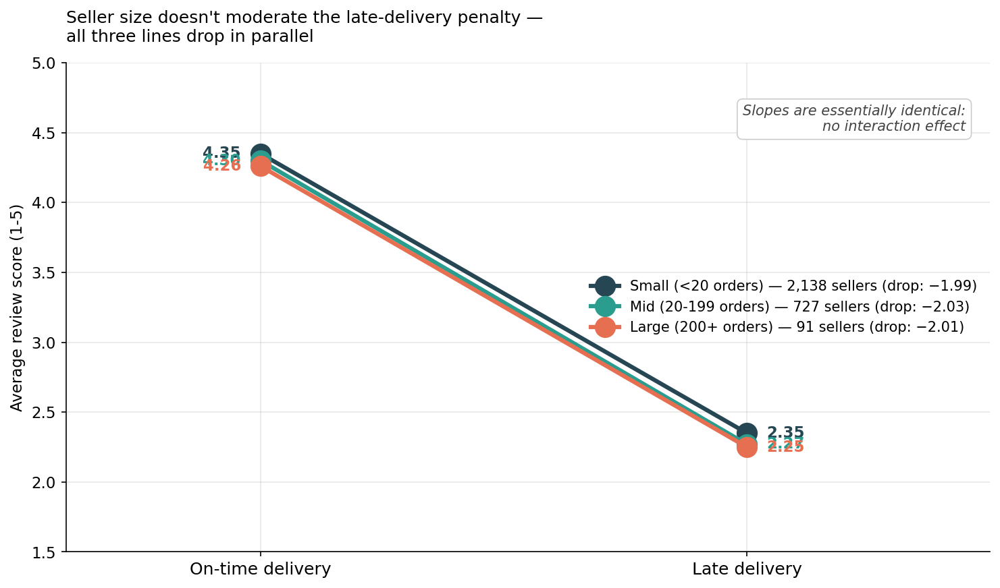
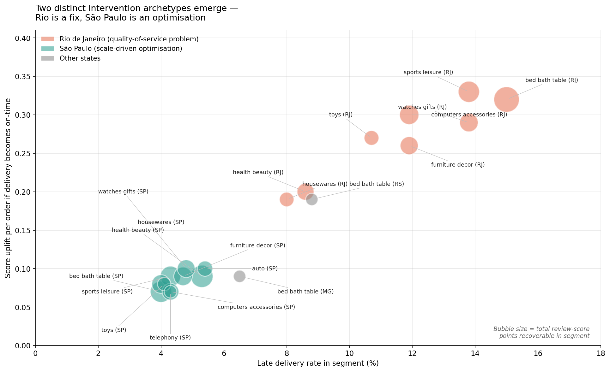
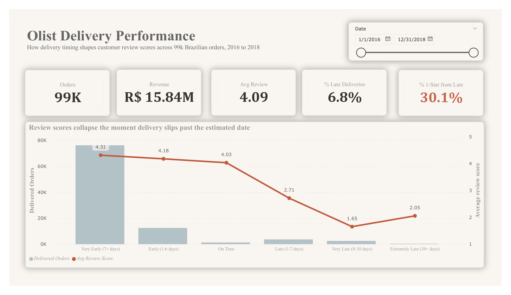
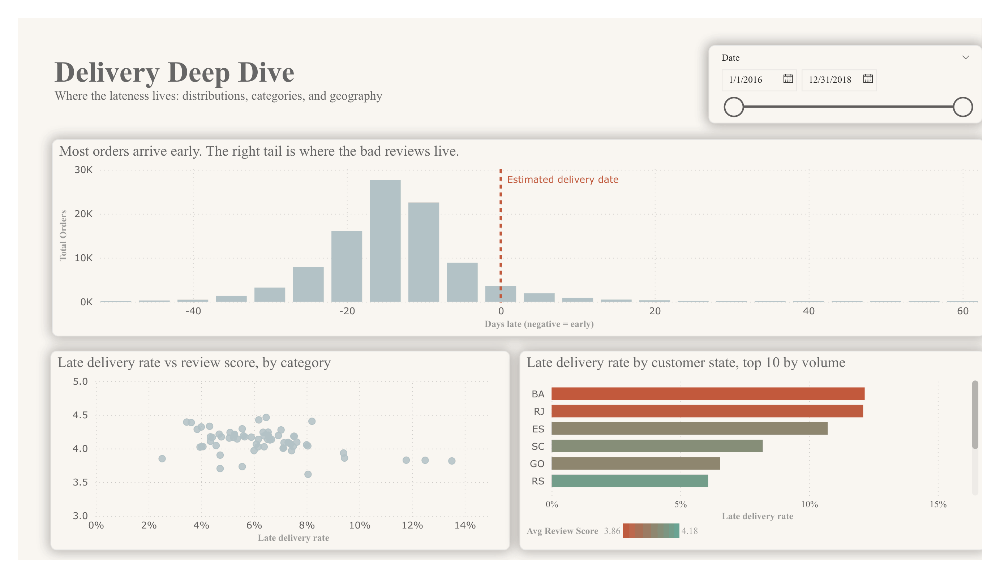
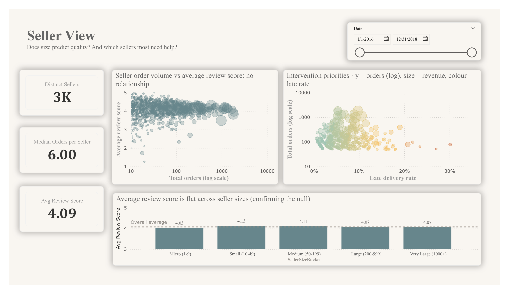

# Olist Delivery Performance Analysis

A SQL-driven investigation into whether delivery performance drives customer review scores on Olist, a Brazilian e-commerce platform. Short answer: it does, and the effect is larger than most other factors in the dataset.

The headline number: crossing the estimated delivery date by even a single day costs sellers an average of **1.4 stars** on their review score. Late deliveries make up only 6.7% of all delivered orders but account for 36.6% of all 1-star reviews, a 5x over-representation.

This project started with one question and ended up answering five, each prompted by what the previous finding left unexplained.

---

## Findings

### 1. Late deliveries collapse review scores, and the cliff is sharp

Early and on-time deliveries cluster around 4.1 to 4.3 stars. The moment a delivery crosses its estimated date, the average drops to 2.7. Orders arriving 8-30 days late average 1.65. The relationship is not gradual; there is a hard cliff at day zero.

Olist's delivery estimates are set conservatively. The most common outcome is delivery arriving roughly 13 days before the estimated date, meaning most customers experience a pleasant surprise rather than a deadline. The downside is that crossing even a conservatively-set estimate is interpreted by customers as a genuine failure rather than a minor slip.

A note on baselines. The 1.4-star headline compares the on-time bucket specifically (4.10) to the slightly-late bucket (2.71). Later sections use broader baselines (all non-late orders vs all late orders), which produces a larger gap of roughly 2 stars. Both comparisons are valid; the difference just reflects which populations are being compared.

One anomaly worth noting: orders arriving 30+ days late (n=331) actually score slightly higher than the 8-30 day late bucket. The most likely explanation is category mix in the tail, since very long delays skew toward furniture and other forgiving categories where customers had lower urgency to begin with. The small sample size also limits confidence in this bucket.



### 2. The penalty varies by category, by up to 28%

Toys, sports equipment, and watches or gifts take the harshest hit when delivery goes wrong (score drops of 2.0+ stars). Telephony, furniture, and bedding are more forgiving (drops around 1.75 to 1.9 stars). The pattern maps cleanly onto emotional stakes: a late birthday gift is a different kind of failure than a late set of bed sheets.



### 3. Distance is a confounder, not a direct cause

Cross-country deliveries are 3x more likely to be late than local ones. But when they arrive on time, customers score them nearly identically to local deliveries (4.25 vs 4.35). Customers respond to outcomes, not to geography. The disadvantage long-distance sellers face is a logistics problem, not a fairness problem.



### 4. Seller size doesn't help (null result)

We expected that high-volume sellers would be cut more slack when deliveries went wrong. They aren't. The penalty for a late delivery is roughly 2 stars regardless of whether the seller has shipped 5 orders or 5,000. Order volume, which we used as a proxy for platform presence, does not buy any buffer against bad delivery experiences.

Worth flagging: order volume is a proxy, not a direct measure of brand recognition. A seller with 5,000 orders in bed_bath_table is not a household name. Whether true brand recognition would protect against late-delivery damage is a separate, untested question. What this analysis does show is that operational scale alone does not.



### 5. Two distinct intervention types emerge from the priority ranking

Combining categories, geography, and volume into a single priority metric reveals that the top 20 intervention targets split into two clusters with very different profiles.

**Rio de Janeiro** shows late-delivery rates 3-4x higher than São Paulo across every major category. The per-order penalty is also high, especially in time-sensitive categories. This points to a systemic logistics issue, not a category-specific one.

**São Paulo** already operates well (4-5% late rates), but the sheer order volume means even small improvements recover hundreds of review-score points across the customer base.

These are not interchangeable interventions. Rio needs a fix; São Paulo needs tuning. Different teams, different timelines.



---

## Interactive Power BI Dashboard

The SQL analysis above answers the questions; the dashboard makes the answers explorable. Same data, same findings, presented as three pages with date filtering and cross-page interaction.

### Pages

**Executive Summary**

Headline numbers and the day-zero cliff in one image. The combo chart shows the volume distribution of delivery outcomes alongside the average review score for each bucket, making the 5x overrepresentation of 1-star reviews among late orders visually immediate.



**Delivery Deep Dive**

Distribution of days late, a category-level scatter confirming the relationship holds broadly across product categories, and a state-level breakdown of late rates by customer location.



**Seller View**

The null result on seller size, demonstrated explicitly with a flat bar chart against the overall mean rather than buried in a noisy visual. Paired with an intervention priorities scatter that encodes order volume, revenue, and late rate to surface which sellers most need delivery support.



### How to view

The `.pbix` file is at `dashboard/olist_dashboard.pbix`. Opening it requires Power BI Desktop (free, Windows only). Data preparation is handled by `dashboard/export_csvs.py`, which exports the relevant tables from the SQLite database to CSV for ingestion.

The data model uses a star schema with single-direction relationships from dimensions to facts, bidirectional only on the order_items to orders link to support category-level slicing.

---

## Recommendations

Three concrete moves, in priority order:

**Investigate the Rio de Janeiro logistics gap.** RJ's late-rate is structurally 3-4x higher than SP's in every top-10 category. This is too uniform to be a category problem and too large to be noise. The likely culprits are carrier contracts, distribution node capacity, or last-mile routing.

**Set category-aware delivery estimates.** Olist is already sandbagging conservatively (the modal delivery arrives 13 days before the estimate), but the buffer should be even larger for emotional and gift categories like toys, watches, and sports, where the penalty for slipping is steepest. A uniform buffer across all categories leaves predictable review damage on the table.

**De-prioritise seller-tier badges as a defence against late-delivery damage.** The null result in section 4 shows that seller order volume does not moderate the late-delivery penalty. Volume-based trust signals may be worth building for other reasons (discoverability, conversion), but not as a shield against logistics failures.

### What I'd do next with more data

This analysis is deliberately descriptive. The natural extension would be an ordinal logistic regression predicting review score from delay days (continuous), product category, shipping distance, and order value simultaneously. That model would quantify the marginal effect of each additional day of delay while controlling for the other variables, which is something the bucketed analysis here cannot do cleanly. It would also surface whether the category-sensitivity finding from section 2 survives as a genuine interaction term or is absorbed once you control for price and distance jointly. The dataset has enough volume (96k delivered orders) to support this comfortably.

---

## Limitations

**Correlational, not causal.** This analysis cannot rule out that customers who buy time-sensitive categories are also systematically harsher reviewers in general. A controlled experiment varying delivery promises within a single category would isolate the effect more cleanly.

**Binary simplification.** Most of the analysis splits delivery into on-time vs late, which loses information about delay magnitude. A delivery 1 day late is a different event from one 30 days late. Future work could use a continuous delay variable and report effect sizes per additional day.

About 600 orders (under 1%) were excluded from the distance analysis due to missing geolocation entries. Category attribution uses the first item per order, which is defensible for single-item orders (the majority) but misses multi-category basket effects.

---

## Project structure

```
olist-delivery-analysis/
├── README.md
├── setup/
│   └── 01_create_indexes.sql    # Run once after downloading the database
├── queries/
│   ├── 01_delivery_score_baseline.sql
│   ├── 02_category_variation.sql
│   ├── 03_distance_confounder.sql
│   ├── 04_seller_size_interaction.sql
│   └── 05_intervention_priorities.sql
├── notebooks/
│   └── analysis.ipynb           # Full analysis with charts and narrative
├── figures/                     # Chart outputs from the notebook
├── dashboard/
│   ├── olist_dashboard.pbix
│   ├── export_csvs.py
│   └── screenshots/
├── data/
│   └── README.md                # Download instructions for the dataset
└── requirements.txt
```

## Reproducing this analysis

1. Clone the repo.
2. Download the Olist SQLite database from [Kaggle](https://www.kaggle.com/datasets/terencicp/e-commerce-dataset-by-olist-as-an-sqlite-database) and place `olist.sqlite` in `data/`.
3. Run `setup/01_create_indexes.sql` once against the database to create join-key indexes. The raw database ships without any, which makes the geolocation joins impractically slow.
4. Create a virtual environment and install dependencies:
   ```bash
   python -m venv .venv
   source .venv/bin/activate   # or .venv\Scripts\activate on Windows
   pip install -r requirements.txt
   ```
5. Open and run `notebooks/analysis.ipynb`. Total runtime is under a minute on a laptop.

The SQL queries in `queries/` are also independently runnable against the database using any SQLite client (DB Browser, SQLTools, DuckDB, the sqlite3 CLI).

## Tools

Python (pandas, matplotlib), SQL (SQLite), Jupyter, VS Code with SQLTools, Power BI Desktop (DAX).

## Data source

[Brazilian E-Commerce Public Dataset by Olist](https://www.kaggle.com/datasets/olistbr/brazilian-ecommerce), provided as a [pre-built SQLite database](https://www.kaggle.com/datasets/terencicp/e-commerce-dataset-by-olist-as-an-sqlite-database). Real anonymised commercial data covering approximately 100,000 orders placed between 2016 and 2018.